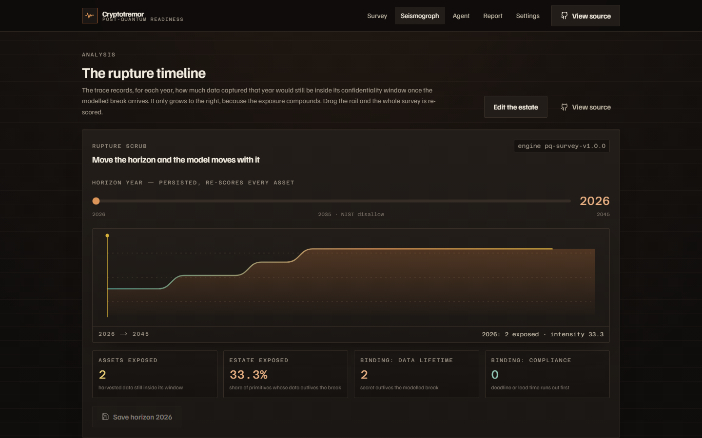
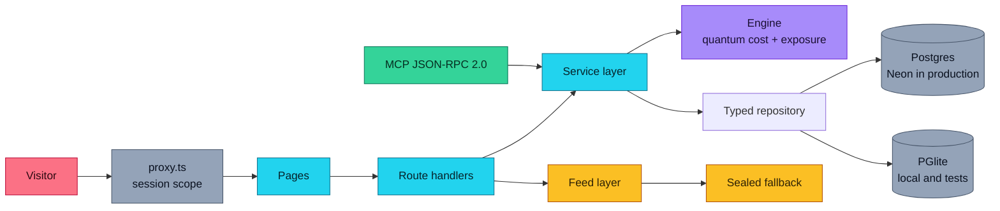
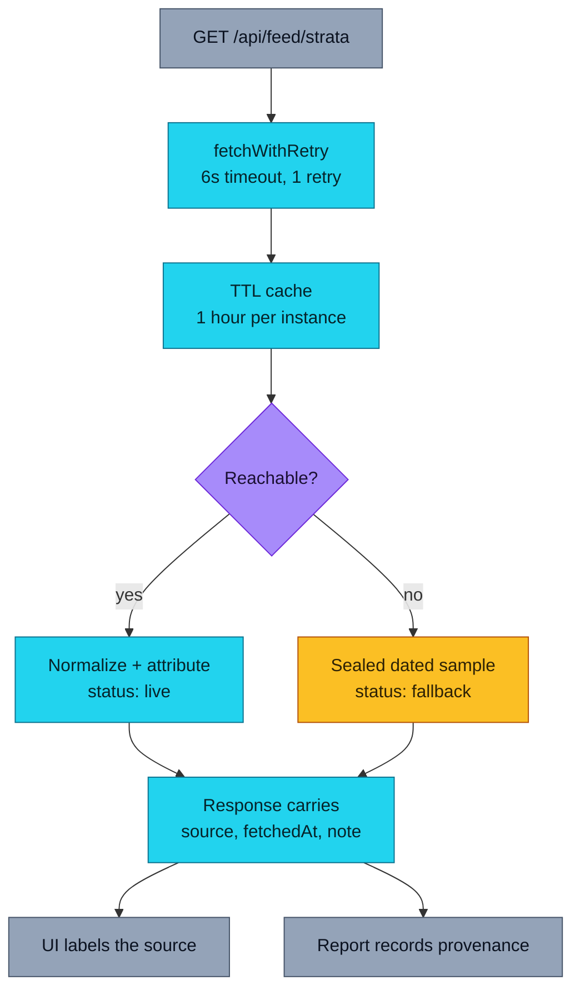
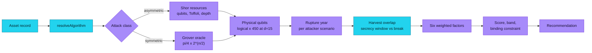
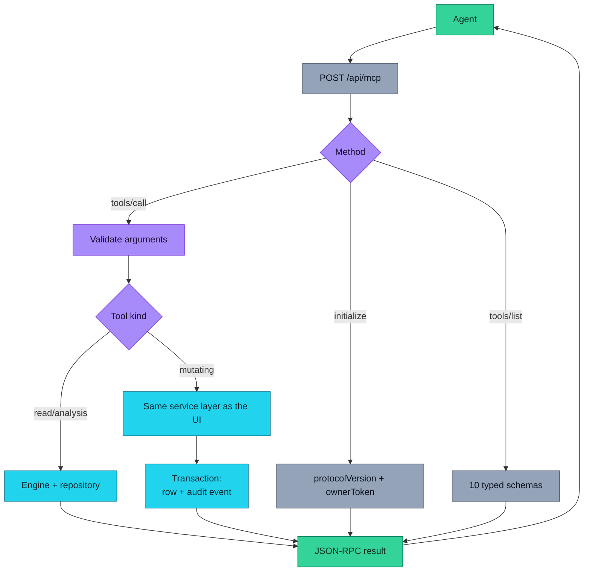
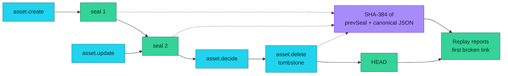
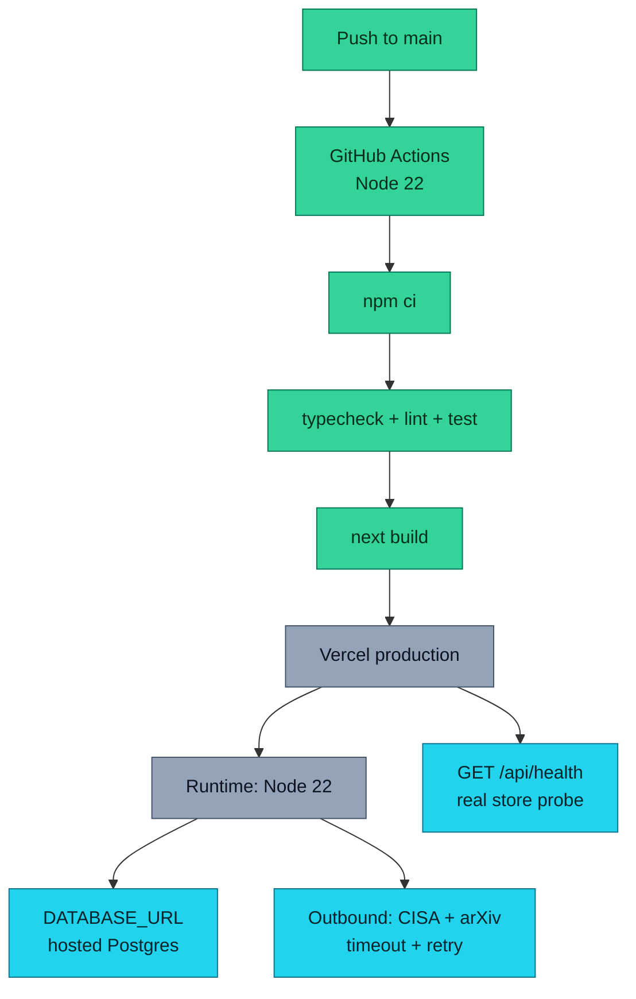
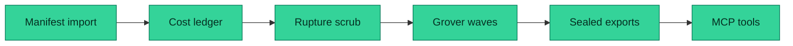
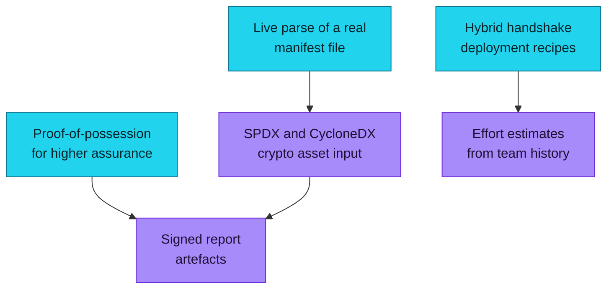
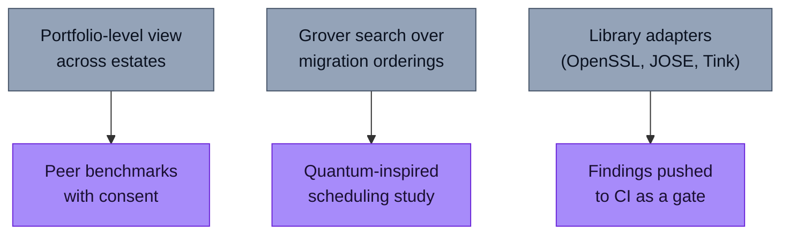

<h1 align="center">Cryptotremor</h1>
<p align="center"><strong>Survey your cryptography before the quantum deadline finds it.</strong></p>
<p align="center">
  <a href="https://cryptotremor.vercel.app"></a>
  <a href="LICENSE"></a>
  <a href="#-quickstart"></a>
  <a href="#-api"></a>
  <a href="https://www.cisa.gov/sites/default/files/feeds/known_exploited_vulnerabilities.json"></a>
  <a href="/agent"></a>
</p>

<p align="center">
  <a href="https://cryptotremor.vercel.app"><strong>Live App</strong></a> ·
  <a href="https://github.com/aniruddhaadak80/cryptotremor"><strong>GitHub</strong></a> ·
  <a href="https://cryptotremor.vercel.app/api/health"><strong>API</strong></a> ·
  <a href="https://cryptotremor.vercel.app/agent"><strong>Agent</strong></a> ·
  <a href="https://github.com/aniruddhaadak80/cryptotremor/issues"><strong>Issues</strong></a>
</p>

---

RSA and elliptic-curve keys are not going to "break someday". An adversary can harvest your traffic
**now** and read it once a cryptographically relevant quantum computer exists. What breaks first is
not your newest key — it is the data with the **longest confidentiality lifetime**.

Cryptotremor takes a cryptographic manifest and tells you, per primitive:

- what a quantum adversary would actually have to build to break it (logical qubits, non-Clifford
  operations, physical qubits at a distance-15 surface code),
- the year a break would cost less than a day, under three published attacker scenarios,
- which constraint actually binds you — the quantum computer, the compliance deadline, or the fact
  that your data outlives both,
- what to migrate to, in what order, and what that removes from your risk.

Then it hands your partners a report they can verify.



<sub>The seismograph: the share of the estate whose data outlives the modelled break, year by year.
Dragging the rail re-scores every asset and persists the new horizon.</sub>

---

## ✨ Features

| Outcome you get | How it works |
| --- | --- |
| **Know which key breaks first** | A Shor/Grover resource ledger per primitive, calibrated against published factoring estimates |
| **See the real deadline, not a vibe** | Three attacker roadmaps side by side, plus four published compliance regimes with cited milestones |
| **Understand every point of the score** | Six weighted factors, each carrying the sentence that produced it and the lever that moves it |
| **Migrate the right system first** | Grover amplitude amplification picks the system that removes the most exposure per year of work |
| **Prove the record afterwards** | Append-only SHA-384 hash chain over canonical JSON, replayable per primitive and in bulk |
| **Share without accounts** | Frozen, server-stored snapshot served from a public route with the chain head attached |
| **Drive it from an agent** | Ten typed tools over MCP-style JSON-RPC 2.0, mutations idempotent and scoped to your estate |

---

## 🔌 API

Everything the interface does is a real endpoint. Create, read back, then delete:

```bash
# 1. Import a manifest (CSV or JSON), or ask for the bundled reference estate
curl -sX POST https://cryptotremor.vercel.app/api/survey/import \
  -H 'content-type: application/json' \
  -b cookies.txt -c cookies.txt \
  -d '{"sample":true}' | jq '.created, .assets[0]'

# 2. Create one primitive
curl -sX POST https://cryptotremor.vercel.app/api/assets \
  -H 'content-type: application/json' \
  -b cookies.txt -c cookies.txt \
  -d '{"label":"Partner SFTP key exchange","system":"partner-sftp","usage":"key-establishment",
       "algorithm":"DH-2048","deployment":"partner-shared","confidentialityYears":10,
       "dataClass":"confidential","ownerTeam":"integrations","notes":"","cve":null}' \
  | jq '{score: .exposure.score, band: .exposure.band, seal}'

# 3. Read it back
curl -s https://cryptotremor.vercel.app/api/assets -b cookies.txt | jq '.assets[] | {label, exposureScore, ruptureYear}'

# 4. Inspect the full ledger and factor evidence for one id
curl -s https://cryptotremor.vercel.app/api/assets/<id> -b cookies.txt \
  | jq '.exposure.quantum, .exposure.factors[] | {label, points, evidence}'

# 5. Record a decision, re-score and seal
curl -sX PATCH https://cryptotremor.vercel.app/api/assets/<id> \
  -H 'content-type: application/json' -b cookies.txt \
  -d '{"decision":"schedule","decisionNote":"dual-deploy hybrid handshake"}' | jq '{score: .asset.exposureScore, seal}'

# 6. Change the horizon year and re-score the whole estate
curl -sX PATCH https://cryptotremor.vercel.app/api/survey \
  -H 'content-type: application/json' -b cookies.txt -d '{"horizonYear":2031}' | jq '.rescored'

# 7. Export a partner report, then replay the audit chain
curl -s 'https://cryptotremor.vercel.app/api/report?format=markdown' -b cookies.txt
curl -s https://cryptotremor.vercel.app/api/verify -b cookies.txt | jq '{ok, events, tamperedEntities}'

# 8. Retire a primitive (tombstoned, never erased)
curl -sX DELETE https://cryptotremor.vercel.app/api/assets/<id> \
  -H 'content-type: application/json' -b cookies.txt -d '{"reason":"replaced by ML-KEM"}' | jq '{tombstone}'
```

Anonymous ownership is an opaque 128-bit scope in an HTTP-only cookie. Keep it with `-b/-c
cookies.txt`; another scope sees nothing of yours.

### Agent interface

The MCP endpoint returns an `ownerToken` on `initialize`. Send it back as `x-ct-owner` and a
stateless client keeps the same estate:

```bash
BASE=https://cryptotremor.vercel.app

# Handshake → capture the owner token
TOKEN=$(curl -sX POST $BASE/api/mcp -H 'content-type: application/json' \
  -d '{"jsonrpc":"2.0","id":1,"method":"initialize","params":{"protocolVersion":"2024-11-05"}}' \
  | jq -r '.result.ownerToken')

# Discover the typed tools
curl -sX POST $BASE/api/mcp -H 'content-type: application/json' \
  -d '{"jsonrpc":"2.0","id":2,"method":"tools/list","params":{}}' | jq '.result.tools[].name'

# Mutate through the same service layer the UI uses (idempotent on the key)
curl -sX POST $BASE/api/mcp -H 'content-type: application/json' -H "x-ct-owner: $TOKEN" \
  -d '{"jsonrpc":"2.0","id":3,"method":"tools/call","params":{"name":"save_asset","arguments":{
       "label":"CI signing key","system":"ci","usage":"signature","algorithm":"RSA-4096",
       "deployment":"internal","confidentialityYears":7,"dataClass":"internal",
       "ownerTeam":"platform","idempotencyKey":"ci-signing-key"}}}'
```

| Tool | Kind | What it does |
| --- | --- | --- |
| `list_assets` | read | Assets with score, band, rupture year and seal |
| `get_asset` | read | One asset plus its full audit trail |
| `estimate_quantum_cost` | analysis | Scores a hypothetical primitive; writes nothing |
| `plan_migration_waves` | analysis | Grover-sequenced wave plan for the estate |
| `save_asset` | **mutating** | Creates and scores a record; idempotent by key |
| `record_decision` | **mutating** | Records a decision and re-scores; idempotent by state |
| `retire_asset` | **mutating** | Tombstones a record; idempotent |
| `create_share_report` | **mutating** | Freezes a partner-readable snapshot |
| `verify_integrity` | read | Replays the SHA-384 chain, reports the first break |
| `strata_signals` | read | Live CISA KEV and arXiv signals with provenance |

Client configuration is served from the live deployment itself:

```json
{
  "mcpServers": {
    "cryptotremor": {
      "type": "http",
      "url": "https://cryptotremor.vercel.app/api/mcp"
    }
  }
}
```

---

## 🚀 Quickstart

Zero required environment variables locally. PGlite is real Postgres compiled to WebAssembly, so
the same SQL, the same `jsonb` columns and the same constraints run on your laptop and in production.

```bash
git clone https://github.com/aniruddhaadak80/cryptotremor.git
cd cryptotremor
npm install
npm run dev            # http://localhost:3000
```

Then load the reference estate from the landing page, or import your own manifest.

| Command | What it does |
| --- | --- |
| `npm run dev` | Dev server with an embedded database at `.tremor/pgdata` |
| `npm run typecheck` | `tsc --noEmit` |
| `npm run lint` | ESLint |
| `npm test` | 80 deterministic unit and integration tests (`node --test`) |
| `npm run build` | Production build |
| `npm run test:browser` | Playwright journey on desktop and mobile viewports |
| `npm run verify:live` | End-to-end HTTP verification against a deployment |

### Production environment

| Variable | Required | Purpose |
| --- | --- | --- |
| `DATABASE_URL` | **yes in production** | Hosted Postgres (Neon). `NEON_DATABASE_URL` / `POSTGRES_URL` also accepted |
| `NEXT_PUBLIC_SITE_URL` | recommended | Canonical origin for metadata, share links and OG tags |
| `DATABASE_POOL_MAX` | no | Pool cap per instance, default `4` |
| `CT_PGDATA` | no | Local PGlite directory, default `.tremor/pgdata` |

The app **refuses to start in production without a database URL** rather than silently using an
ephemeral store, so user data cannot quietly vanish between cold starts.

---

## 📁 Project map

| Route | Responsibility |
| --- | --- |
| `/` | Product entry: real primary action (import or sample), cost ledger preview, live signals |
| `/survey` | Workspace: filter, search, sort (URL state), create, inspect, retire |
| `/asset/[id]` | Dynamic detail: quantum cost ledger, factor evidence, audit trail, decision form |
| `/seismograph` | Analysis: rupture scrub, trace, Grover waves, strata cross-section |
| `/agent` | Live agent console over JSON-RPC 2.0 with full request/response payloads |
| `/report` | Export JSON/Markdown/CSV, freeze and revoke partner share links |
| `/r/[token]` | Public read-only partner view of a frozen snapshot |
| `/settings` | Profile, horizon, regime, attacker scenario, registries, manifest contract |
| `/verify` | Per-primitive and bulk SHA-384 chain replay |

| API route | Methods | Responsibility |
| --- | --- | --- |
| `/api/health` | GET | Real persistence probe plus feed status |
| `/api/assets` | GET, POST | List with filters; create and score |
| `/api/assets/[id]` | GET, PATCH, DELETE | Read, update/record decision, tombstone |
| `/api/survey/import` | POST | CSV/JSON manifest import with per-row reporting |
| `/api/survey` | GET, POST, PATCH, PUT, DELETE | Analysis, settings, re-score, purge |
| `/api/feed/strata` | GET | Normalized CISA KEV and arXiv signals |
| `/api/report` | GET, POST, DELETE | Exports, share snapshots, revocation |
| `/api/share/[token]` | GET | Public frozen snapshot |
| `/api/settings` | GET, PATCH | Profile plus algorithm/policy registries |
| `/api/verify` | GET | Chain replay with first-broken-link reporting |
| `/api/mcp` | GET, POST | JSON-RPC 2.0 agent interface |

```
src/
  app/            routes (pages + route handlers)
  components/     interface: header, footer, trace, rupture console, agent console
  lib/
    engine/       quantum cost, exposure score, Grover search, waves, survey aggregation
    db/           adapter selection, Postgres + PGlite, schema, typed repository
    feed/         CISA KEV and arXiv with TTL cache and sealed fallback
    integrity/    canonical JSON, SHA-384 seals, replay
    domain/       algorithm registry, compliance regimes, attacker profiles
  proxy.ts        anonymous session bootstrap
scripts/
  verify-live.mjs end-to-end live verification
tests/browser/    Playwright primary journey
```

---

## Architecture



The engine, the repository and the feed layer are plain TypeScript modules. The same
`scoreAsset` call serves the server components, the REST handlers, the MCP tools and the exported
report — there is no second implementation to drift.

## Data pipeline and honest fallback



Two keyless public sources: the **CISA Known Exploited Vulnerabilities catalog** and **arXiv
quant-ph**. Every response states `status`, `source`, `sourceUrl`, `attribution`, `fetchedAt` and a
note. Fallback data is a sealed, dated sample and is never presented as current. User-created data
is never replaced by fallback data. Next's own data cache is not used for the KEV catalog because it
exceeds the 2 MB ceiling and would silently re-download on every request.

## The deterministic engine



**What is grounded and what is extrapolated.** The *shape* of the resource estimate is grounded: a
working register proportional to the modulus, a Toffoli count superlinear in it, and Grover's
quadratic search over key space. The coefficients are calibrated so RSA-2048 lands at ~2.9k logical
qubits and ~1.7e8 Toffoli operations, the same order as published factoring estimates (Gidney &
Ekerå 2021: 20M noisy qubits / 8 hours; Gidney 2025: ~1M noisy qubits / ~1 week). The *year* is a
scenario: no cryptographically relevant quantum computer exists, so the app reports three
throughput roadmaps side by side rather than one confident date.

**The most useful output is usually not the rupture year.** It is the **binding constraint**:

| Constraint | Meaning |
| --- | --- |
| `data-lifetime` | Your data must stay secret past the modelled break, so captured traffic becomes readable retroactively. Start now. |
| `compliance` | A published deadline, or your migration lead time, runs out before capability does |
| `capability` | The quantum computer is genuinely the limit; the start date still decides the outcome |
| `none` | Already post-quantum, or Grover-safe |

### Weighting

| Factor | Weight | What it measures |
| --- | --- | --- |
| Algorithm class | 0.22 | Whether a quantum algorithm reduces the primitive at all |
| Harvest lifetime | 0.20 | Years of confidentiality that outlive the modelled break |
| Compliance clock | 0.16 | Distance to the binding milestone in the selected regime |
| Migration lead time | 0.16 | Estimated years of work against the runway available |
| Data classification | 0.14 | Public → regulated |
| Exposure surface | 0.12 | Internal → internet and partner-shared |

A recorded decision then multiplies the raw exposure by a documented relief factor, so the raw
exposure and the operational decision stay separately visible.

### Grover-sequenced migration waves

A wave is a *system*, because replacing one library retires every primitive that depends on it.
Picking the best system out of *n* candidates is exactly the unstructured search Grover solves in
`O(sqrt(n))` oracle calls, so each round runs one amplitude-amplification search, rotates the winner
out, and reports the measured probability gain over the uniform baseline. The implementation is
exact — uniform initial state, double precision, argmax as "measurement" — so the same estate always
produces the same wave order.

## Agent sequence



Mutations are idempotent: `save_asset` takes an `idempotencyKey` backed by a unique index, and
`record_decision` / `retire_asset` are no-ops when the record is already in the target state. A
retried agent call can never inflate the audit chain or duplicate a record.

## Integrity and seal replay



```
seal_0 = SHA-384(GENESIS || canonicalJson(event_1))
seal_n = SHA-384(UTF-8(prevSeal) || canonicalJson(event_n))
```

Canonical JSON sorts object keys recursively, preserves array order, drops `undefined`, rejects
non-finite numbers and emits no whitespace, so two events that mean the same thing hash the same.
Every row and its audit event are written in one transaction, deletions leave a tombstone, and the
replay endpoint names the first broken link rather than returning a boolean. Known-answer vectors
and a published SHA-384 vector are asserted in the test suite.

## Deployment



## User journey


---

## Security model

- **Anonymous ownership.** No accounts. A visitor owns an estate through a 128-bit random scope in an
  HTTP-only, `SameSite=Lax`, `Secure`-in-production cookie. Every query is scoped by it, so one
  visitor can never read or mutate another's records. Cross-scope reads return `404`.
- **Owner capability for agents.** `x-ct-owner` accepts the same 128-bit scope so stateless MCP
  clients keep their estate. Possession of the token *is* ownership, at the same strength as the
  cookie.
- **Validation.** Every write goes through bounded zod schemas. Strings, URLs, enum values and
  numeric ranges are capped; manifests are capped at 200 rows and 200 KB; SQL is parameterized.
- **Abuse controls.** Per-scope rate limits on writes, imports, shares and MCP calls. **Honest
  limitation:** this is an in-process map, so it is a floor rather than a guarantee on serverless —
  a determined attacker can spread requests across instances. Real limiting belongs at the edge
  (Vercel WAF, Cloudflare, Upstash).
- **Secrets.** No secret is committed, bundled into the client, logged, or returned in an error.
  `DATABASE_URL` is read at runtime only.
- **Response headers.** `X-Content-Type-Options`, `Referrer-Policy`, `X-Frame-Options: DENY` and a
  restrictive `Permissions-Policy` on every route.
- **Rendering.** User content is escaped by React; no untrusted HTML is ever injected.

---

## 🗺️ Roadmap

### Now — shipped



Everything on this diagram is in the running deployment and covered by `npm run verify:live`.

### Next — measured, not guessed



### Later — open questions



---

## Contributing

Issues and pull requests are welcome, especially ones that improve the **accuracy or honesty** of
the model. The most valuable contributions would add a published resource estimate with a citation,
a real manifest format, or a compliance regime we have missed.

```bash
git clone https://github.com/aniruddhaadak80/cryptotremor.git
cd cryptotremor
npm install
npm run typecheck && npm run lint && npm test && npm run build
```

If you change the engine, add unit tests for normal, boundary, empty, malformed and
deterministic-repeat cases, and re-run `npm run verify:live` against a deployment before opening a
pull request. See [CONTRIBUTING.md](CONTRIBUTING.md) and [SECURITY.md](SECURITY.md).

## Data sources and attribution

- **CISA Known Exploited Vulnerabilities Catalog** — CISA, public domain.
  <https://www.cisa.gov/sites/default/files/feeds/known_exploited_vulnerabilities.json>
- **arXiv quant-ph** — arXiv, per-item licences.
  <https://arxiv.org/list/quant-ph/recent>
- **NIST post-quantum cryptography** — FIPS 203 (ML-KEM), FIPS 204 (ML-DSA), FIPS 205 (SLH-DSA),
  and NIST IR 8547 *Transition to Post-Quantum Cryptography Standards*.
  <https://csrc.nist.gov/projects/post-quantum-cryptography>
- **NCCoE Migration to Post-Quantum Cryptography** project and FAQ.
  <https://pages.nist.gov/nccoe-migration-post-quantum-cryptography/>
- **EO 14412 / OMB M-26-15**, **CNSA 2.0** (NSA) and the **UK NCSC** roadmap, cited per milestone in
  the registry.
- **Resource-estimate anchors:** Gidney & Ekerå (2021) and Gidney (2025) for factoring estimates;
  Grover (1996) and Shor (1994/1997) for the algorithms.

## ⚠️ Safety disclaimer

Cryptotremor produces **planning estimates, not a security audit, a compliance determination or a
cryptographic review**. Rupture years are scenarios derived from published resource estimates and
an assumed attacker roadmap; they are not predictions, and no cryptographically relevant quantum
computer currently exists. Have a qualified cryptographer review any migration decision, and treat
compliance milestones as sourced from the cited documents rather than from this tool.

## License

[MIT](LICENSE) © [aniruddhaadak80](https://github.com/aniruddhaadak80)